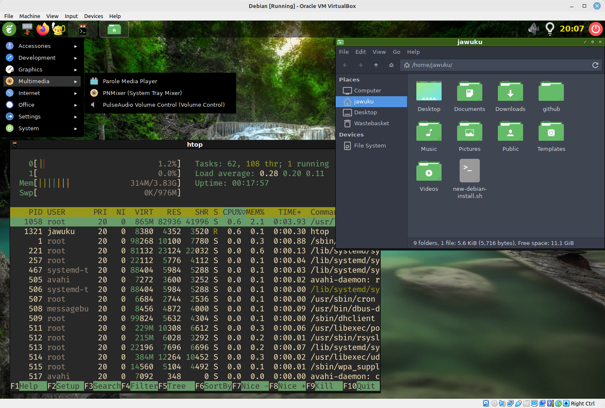

## dotfiles - subject to regular change
### 1) Debian 11 (Stable) Automated Install Script
#### Installs basic Openbox system, minus languages and tools
#### May install them with the Nix package manager in future

#### Designed for Virtual Machines e.g. Virtualbox on x86_64
#### Install fresh Debian 11 Netinstall
#### with standard system utils only (no desktop environment)

#### Login as normal user, use sudo password as requested
```sh
wget https://raw.githubusercontent.com/jawuku/dotfiles/master/os_setups/new-debian-install.sh
chmod +x new-debian-install.sh
./new-debian-install.sh
```
#### Screenshots - Standard Debian 11 login manager theme (slick-greeter)

#### Sample Desktop (note wallpaper cycles randomly each login)
* GTK theme is Layan Dark
* Icon theme Tela Green Dark
* Window Decoration theme is Nightmare-03
* Menu is standard jgmenu

### 2) Configuration files for NixOS XFCE
### Currently on a VM (e.g. Parallels on macOS, or VirtualBox)

#### Choose to install a plain NixOS system (without desktop environment)
#### add following packages to /etc/nixos/configuration.nix when installing
```
environment.systemPackages = with pkgs; [
    wget git subversion curl
    # and other packages already specified ...
];
```
#### Reboot
```sudo reboot```
#### Make copy of configuration.nix
#### (in case something goes wrong)
```sh
cd /etc/
sudo mv nixos/configuration.nix nixos/config-original.nix
```
#### Then download configuration from GitHub:
```sh
sudo svn co https://github.com/jawuku/dotfiles/trunk/nixos
```
#### Change the variables *defaultUser* and *desc*
#### in lines 9 and 10 in /etc/nixos/configuration.nix
#### to your own name, e.g.
```
defaultUser = "jeanluc";
desc = "Jean-Luc Picard";
```
#### and reboot
```
sudo nixos-rebuild switch
sudo reboot
```
#### If everything goes well, welcome to NixOS with XFCE desktop
#### with
* configured neovim with language servers and tree-sitter
* python
* clojure
* R with RStudio
* julia
* octave
* nodejs

### 3) Setup various operating systems in os_setups/
* Debian 11 with Openbox (see above)
* macOS M1 Development Setup
* NixOS (out of date setup - see above instead)
* Debian 10 (Old Setup)
* OpenSuse Post-install (Old)
* Debian 11 install script (Experimental - may not work)
### 3) In wallpapers/ directory
Collected wallapers from
* EznixOS https://sourceforge.net/projects/eznixos/files/Xfce
    * (download tar file and extract backgrounds folder)
* EnsoOS https://github.com/nick92/Enso-OS/tree/master/wallpapers
* MyDebOS (no longer available) https://youtu.be/jpAfVOz6P4Q
### 4) Openbox configs in .config/ directory
* Openbox menu config
* rofi program launcher
* tint2 panel
* jgmenu dynamic menu
* kitty terminal emulator
* sakura terminal emulator
### 5) Miscellaneous config files
* .Xresources
* Old vim configurations
* .zshrc
        
* .config/nvim/* - *outdated - don't use*

